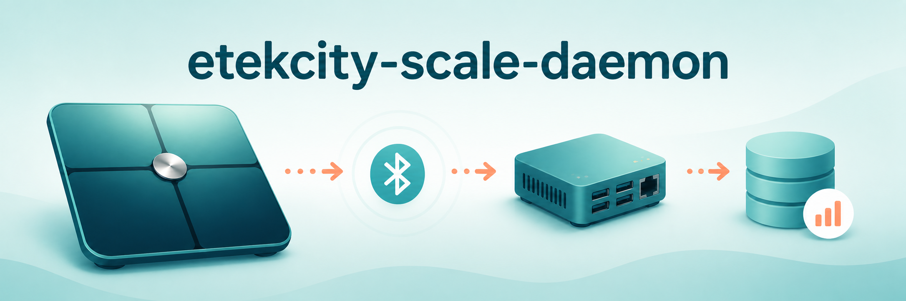

# etekcity-scale-daemon



  

[](https://github.com/home-health-hub/etekcity-scale-daemon/blob/main/LICENSE) [](https://github.com/home-health-hub/etekcity-scale-daemon#contributing) [](https://github.com/home-health-hub/etekcity-scale-daemon/discussions)

A standalone Linux daemon that connects to an Etekcity smart fitness scale over Bluetooth Low Energy (BLE) and logs its measurements to a local SQLite database. No cloud account, no companion app, no Home Assistant required.

It's a thin wrapper around the [`etekcity_esf551_ble`](https://github.com/ronnnnnnnnnnnnn/etekcity_esf551_ble) library, packaged to run unattended as a `systemd` service on something like a Raspberry Pi sitting near the scale.

**Disclaimer: This is an unofficial, community-developed project. It is not affiliated with, officially maintained by, or in any way officially connected with Etekcity, VeSync Co., Ltd., or any of their subsidiaries or affiliates.**

## Supported scales

Whatever the underlying library supports at the time of installation:

| Model | Status |
|-------|--------|
| ESF-551 | Fully supported |
| EFS-A591S (Apex HR) | Experimental (adds heart rate) |
| ESF-24 | Experimental |
| FIT-8S | Experimental |

## Features

- Scans for any supported scale on first run, then pins its BLE address and model into the config file so future restarts connect directly instead of re-scanning
- Records every measurement (weight, impedance, and heart rate where available) to a local SQLite database
- Runs as a `systemd` service with automatic restart on failure
- No body-metrics calculation or cloud sync, just raw readings, timestamped

## Installation

Requires Python 3.11+.

### Quick install

```bash
git clone https://github.com/home-health-hub/etekcity-scale-daemon.git
cd etekcity-scale-daemon
sudo ./install.sh
```

This creates a venv at `/opt/etekcity-scale-daemon`, installs the package from the checkout, seeds `/etc/etekcity-scale-daemon/config.ini` (if it doesn't already exist), creates an `etekcity-scale-daemon` system user, and installs and enables the systemd service. It also installs (but does not enable) the [scheduled report generation](https://github.com/home-health-hub/etekcity-scale-daemon/wiki/Scheduled-Reports) and [alerting](https://github.com/home-health-hub/etekcity-scale-daemon/wiki/Alerting) timer units, and the [HTTP API](https://github.com/home-health-hub/etekcity-scale-daemon/wiki/HTTP-API) service. It's safe to re-run: it skips steps that are already done. Edit the config and `sudo systemctl restart etekcity-scale-daemon` afterward.

### Manual install

Prefer to install by hand, or want to customize a step? See the [Installation wiki page](https://github.com/home-health-hub/etekcity-scale-daemon/wiki/Installation) for manual venv/pip setup, the full `config.ini` reference table, and systemd unit setup.

### Optional add-ons

A few pieces are installed but not enabled by default; each is documented on its own wiki page:

- **[Scheduled report generation](https://github.com/home-health-hub/etekcity-scale-daemon/wiki/Scheduled-Reports)** — drop a timestamped PDF to disk on a recurring schedule.
- **[Alerting](https://github.com/home-health-hub/etekcity-scale-daemon/wiki/Alerting)** — Apprise notifications for stale scales or weight swings.
- **[HTTP API](https://github.com/home-health-hub/etekcity-scale-daemon/wiki/HTTP-API)** — a small read-only local HTTP server exposing the same data as the CLI tools.
- **[Profiles](https://github.com/home-health-hub/etekcity-scale-daemon/wiki/Profiles)** — tag readings by person on a shared scale, with per-profile body composition and goal-progress reporting.

## Manual usage

```bash
etekcity-scale-daemon --config /etc/etekcity-scale-daemon/config.ini
etekcity-scale-daemon --config /etc/etekcity-scale-daemon/config.ini --verbose
```

Validate a config file (all sections) without starting the daemon:

```bash
etekcity-scale-daemon --config /etc/etekcity-scale-daemon/config.ini --check-config
```

### On-demand capture instead of a long-running service

`--once` records a single measurement and exits, instead of running until stopped: for when you'd rather not run the daemon continuously, start it by hand right before (or while) stepping on the scale. It waits up to `--once-timeout` seconds (default 60) for a reading and exits non-zero if none arrives in time:

```bash
etekcity-scale-daemon --config /etc/etekcity-scale-daemon/config.ini --once --once-timeout 30
```

On the very first run, if `[scale] address`/`model` are still empty, `--once` also uses `--once-timeout` as the scale-discovery timeout (instead of a separate 60-second default). Worst case, an undiscovered scale can take up to `2 * --once-timeout` before giving up. Once discovered, the address is saved back into the config (as always), so every run after that only waits `--once-timeout` for the measurement itself.

## Database schema

Each measurement is inserted as one row into a `measurements` table (timestamp, address, model, weight, impedance, heart rate where available). See the [Database Schema wiki page](https://github.com/home-health-hub/etekcity-scale-daemon/wiki/Database-Schema) for the full column reference. Query it directly with `sqlite3`, or point any BI/graphing tool at the file.

## Reports

`etekcity-scale-report` reads the database and writes a table of readings to a PDF or CSV file:

```bash
etekcity-scale-report --config /etc/etekcity-scale-daemon/config.ini --output report.pdf
```

See the [Generating Reports wiki page](https://github.com/home-health-hub/etekcity-scale-daemon/wiki/Generating-Reports) for preset/explicit date ranges, CSV export, multi-scale reports, and body-composition/goal-progress sections. See [samples/](samples/) for a rendered PDF of every layout/unit/date-format combination.

## Pruning old data

`etekcity-scale-prune` deletes measurements older than a given number of days. It's manual only, and a **dry run by default** until you pass `--yes`:

```bash
etekcity-scale-prune --config /etc/etekcity-scale-daemon/config.ini --older-than 365 --yes
```

See the [Pruning wiki page](https://github.com/home-health-hub/etekcity-scale-daemon/wiki/Pruning) for the dry-run output, `--address` filtering, and `--db` usage.

## MQTT

Set `[mqtt] enabled = yes` (plus `host`) to publish each measurement to an MQTT broker as JSON, alongside the local SQLite recording. See the [MQTT wiki page](https://github.com/home-health-hub/etekcity-scale-daemon/wiki/MQTT) for the full config reference, topic/payload format, and failure behavior.

## Troubleshooting

On Raspberry Pi (and other BlueZ-based Linux systems), a `org.bluez.Error.InProgress` error usually clears up by power-cycling Bluetooth. See the [Troubleshooting wiki page](https://github.com/home-health-hub/etekcity-scale-daemon/wiki/Troubleshooting) for the commands.

## Acknowledgments

- Scale hardware designed and sold by [Etekcity](https://www.etekcity.com) / [VeSync Co., Ltd.](https://www.vesync.com) (see the Disclaimer above).
- Built on [`etekcity_esf551_ble`](https://github.com/ronnnnnnnnnnnnn/etekcity_esf551_ble) by maintainer [@ronnnnnnnnnnnnn](https://github.com/ronnnnnnnnnnnnn), which does all the BLE protocol and reverse-engineering work.
- Code review, bug fixes, and documentation assisted by [Claude](https://www.anthropic.com/claude).

## Contributing

Contributions are welcome!

- **Bug reports**: [Open an issue](https://github.com/home-health-hub/etekcity-scale-daemon/issues).
- **Everything else** (questions, feature requests, ideas, general discussion): [Use Discussions](https://github.com/home-health-hub/etekcity-scale-daemon/discussions).
- Pull requests are welcome for bug fixes or discussed features.

### Running checks locally

CI (`.github/workflows/ci.yml`) runs `flake8`, the `pytest` suite under `tests/`, and `scripts/smoke-test.sh` on every PR. Run them locally before pushing:

```bash
pip install flake8
flake8 --config .flake8 src tests
pip install ".[test]"
pytest tests/
./scripts/smoke-test.sh
```

## License

This project is licensed under the **GNU General Public License v3.0**.

See [LICENSE](LICENSE) for more information.
